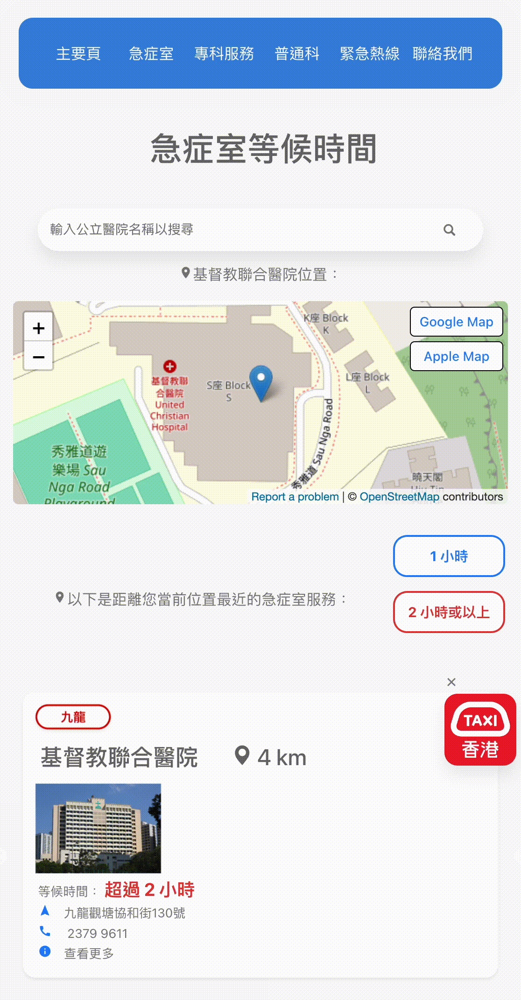
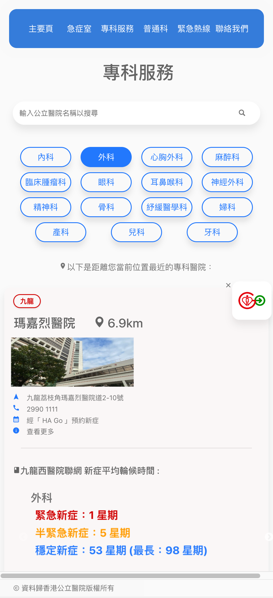
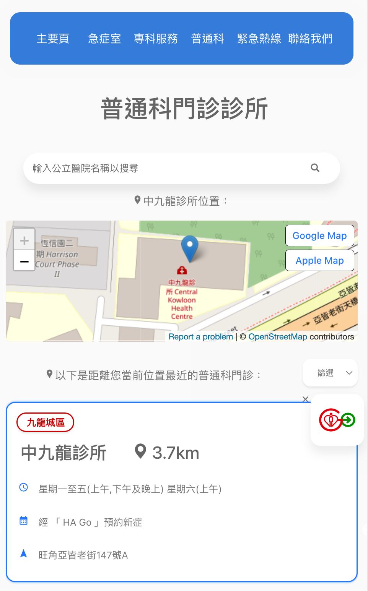
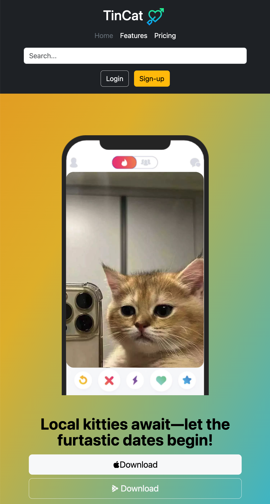
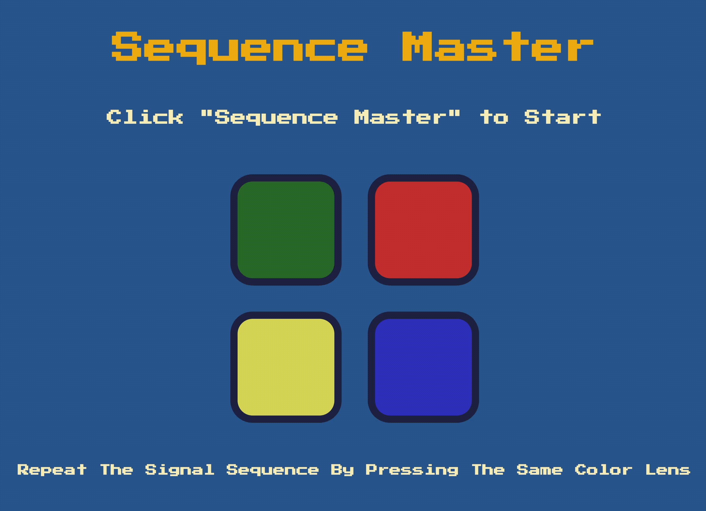
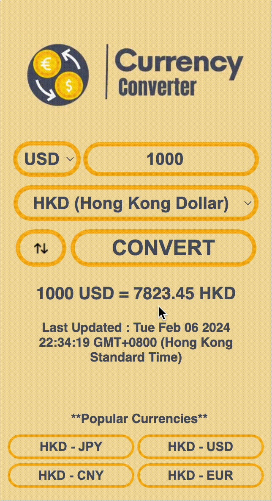
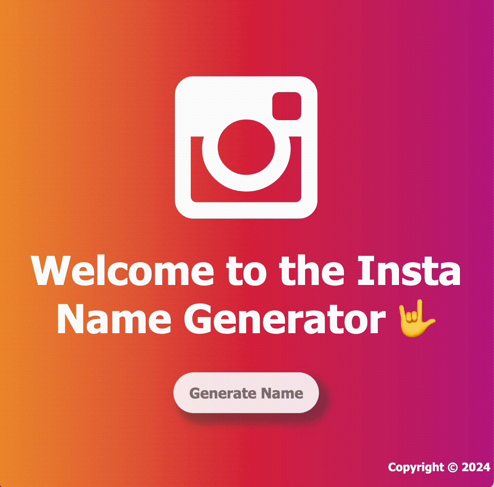

<!--  -->

  

<h1 align="center">Hi 👋, this is Abbie</h1>

<h3 align="center">A passionate frontend developer from Hong Kong</h3>

💬 Ask me about **HTML, CSS, Bootstrap, JavaScript, React and jQuery**

📫 How to reach me : **abbiechengtszying@outlook.com**

🌱 I’m currently learning **Node.js, Express and EJS**

⚡ Fun fact about me: a wine wizard with a WSET Level 3 badge in my collection. If there's a wine question brewing in your mind, I'm your answer sommelier🥂

🚀 Below are some projects I've successfully completed:

## MediFinder

A React-based web application designed to help users in finding 24-hour emergency rooms, specialist services, and general medical services in nearby Hong Kong public hospitals, with real-time data from the HK Hospital Authority API.

- **[GitHub Repo](https://github.com/qwerac388/medi-finder)**

- **[Live Project](https://qwerac388.github.io/MediFinder/)**

- **Preview**

  

  

  

## TinCat

A responsive cat dating web app built with Bootstrap, where local kitties can find their purr-fect match.

- **[GitHub Repo](https://github.com/qwerac388/TinCat)**

- **[Find Your Match Here](https://qwerac388.github.io/TinCat/)**

- **Preview**

  

## Sequence Master Game

A browser-based interactive memory game created with jQuery.

- **[GitHub Repo](https://github.com/qwerac388/sequence-master)**

- **[Play Now](https://qwerac388.github.io/sequence-master/)**

- **Preview**

  

## Currency Converter Chrome Extension

A Chrome extension built with Vanilla JS that seamlessly converts HKD to multiple currencies directly within the browser, using real-time exchange rates fetched from an API.

- **[GitHub Repo](https://github.com/qwerac388/hkd-currency-converter)**

- **[Available at Chrome Web Store](https://chrome.google.com/webstore/detail/hkd-currency-converter/iljbaefgjagfjplmmckmekmdapbdhddk)**

- **Preview**

  

## Insta Name Generator

A web app hosted on Heroku for generating unique Instagram usernames, built with Node.js, Express, and EJS templating.

- **[GitHub Repo](https://github.com/qwerac388/insta-name-generator)**

- **[Try it out](https://insta-name-generator-2bd08e87d766.herokuapp.com/)**

- **Preview**

  

<h3 align="left">Connect with me:</h3>

<h3 align="left">Languages and Tools:</h3>

           

